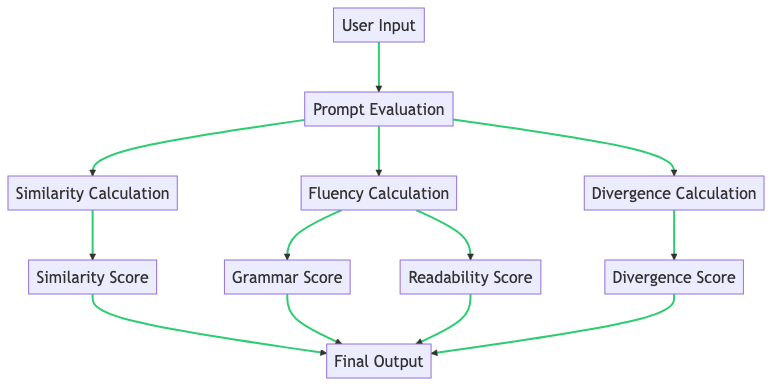
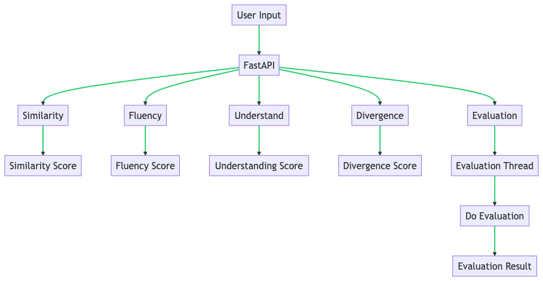
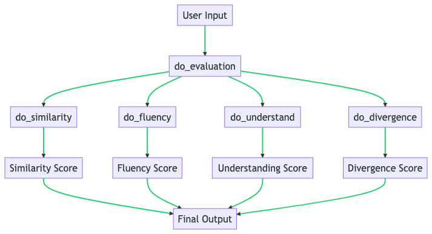
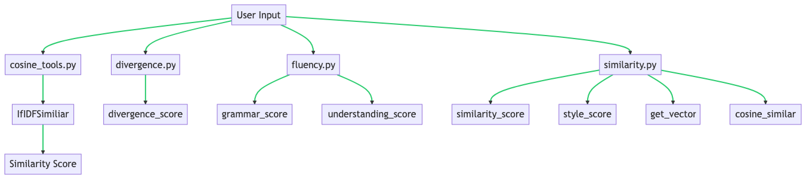

# Prompt-Evaluation

## How to evaulation prompt?

There are three parts to the evaluation prompt:

1. Similarity
2. Fluency
3. Divergence

In the `Similarity` section, it will calculate the `similarity score` and `style score`. The `similarity score` measures how similar the OpenAI predicted content is to the standard content. It use IF-IDF algorithm.

In the `Fluency` section, it will calculate the `grammar score` and `readability score`. The `grammar score` measures how fluent the OpenAI predicted content is. It use OpenAI to check the grammar. The `readability score` measures how easy the OpenAI predicted content is to read. It use Flesch–Kincaid readability tests.

In the `Divergence` section, it will calculate the `divergence score`. The `divergence score` measures how different the OpenAI predicted content is to the standard content. We say that the OpenAI predicted content is divergent if it is different from the standard content. It use OpenAI to check the divergence.

## Brief introduction
Here is a diagram that represents the process flow of the Prompt-Evaluation repository:


The process starts with user input which is passed to the Prompt Evaluation. The Prompt Evaluation then calculates the Similarity, Fluency, and Divergence of the input.

- The Similarity Calculation results in a Similarity Score, which measures how similar the OpenAI predicted content is to the standard content.
- The Fluency Calculation results in a Grammar Score and a Readability Score. The Grammar Score measures how fluent the OpenAI predicted content is, and the Readability Score measures how easy the OpenAI predicted content is to read.
- The Divergence Calculation results in a Divergence Score, which measures how different the OpenAI predicted content is to the standard content.
- These scores are then combined to produce the final output.

## Code Explain

`main.py` and `engine.py` in the Prompt-Evaluation repository might have the following roles:

+ `main.py`: This is likely the entry point of the application. It's where the application starts running. In the context of a web application, `main.py` often contains the code to start the server and define the routes (endpoints) for the API. It might also handle user input and responses.

+ `engine.py`: This script likely contains the core functionality of the application. In this case, it seems to contain the functions for evaluating prompts, such as calculating similarity, fluency, understanding, and divergence.

The relationship between `main.py` and `engine.py` is likely that `main.py` calls functions from `engine.py`. When a user makes a request to the application (such as sending a prompt to be evaluated), `main.py` would handle that request and then call the appropriate function in `engine.py` to perform the evaluation. The results would then be returned to `main.py`, which would send them back to the user.

+ main.py


The process starts with user input which is passed to FastAPI. FastAPI then routes the request to the appropriate function based on the endpoint hit. These functions include Similarity, Fluency, Understand, Divergence, and Evaluation.

- The Similarity function calculates a Similarity Score.
- The Fluency function calculates a Fluency Score.
- The Understand function calculates an Understanding Score.
- The Divergence function calculates a Divergence Score.
- The Evaluation function creates a new thread to perform the evaluation and returns an ID for the evaluation.
- The Evaluation Thread then calls the do_evaluation function, which performs the actual evaluation and returns the result.

+ engine.py

Here is a diagram that represents the process flow of the engine.py script in the Prompt-Evaluation repository:


The process starts with user input which is passed to the do_evaluation function. This function then calls the do_similarity, do_fluency, do_understand, and do_divergence functions.

- The do_similarity function calculates a Similarity Score.
- The do_fluency function calculates a Fluency Score.
- The do_understand function calculates an Understanding Score.
- The do_divergence function calculates a Divergence Score.
- These scores are then combined to produce the final output.

+ cosine_tools.py divergence.py fluency.py similarity.py


In summary:

- User input is processed by four different scripts: `cosine_tools.py`, `divergence.py`, `fluency.py`, and `similarity.py`.
- `cosine_tools.py` calculates the similarity score of two strings using the IfIDFSimiliar function.
- `divergence.py` calculates the divergence score of two contents.
- `fluency.py` calculates the grammar and understanding scores of a content.
- `similarity.py` calculates the similarity score, style score, and cosine similarity of two contents. It also gets the vector of a content.

## Example

### Similarity

```json
{
    "eval": {
        "model": "gpt-3.5-turbo",
        "messages": [
            {
                "role": "user",
                "content": "I am a student. What about you?"
            }
        ],
        "temperature": 0,
        "max_tokens": 2300,
        "frequency_penalty": 0,
        "presence_penalty": 2
    },
    "stand": {
        "answer": "As an AI language model, I don't have a physical form or occupation like humans do. My purpose is to assist and communicate with users through text-based conversations."
    }
}
```

## Fluency

```json
{
    "eval": {
        "model": "gpt-3.5-turbo",
        "messages": [
            {
                "role": "user",
                "content": "I am a student. What about you?"
            }
        ],
        "temperature": 0,
        "max_tokens": 2300,
        "frequency_penalty": 0,
        "presence_penalty": 2
    }
}
```

## Divergence

```json
{
    "eval": {
        "model": "gpt-3.5-turbo",
        "messages": [
            {
                "role": "user",
                "content": "As an AI language model, I don't have a physical form or occupation like humans do. My purpose is to assist and communicate with users through voice-based conversations."
            }
        ],
        "temperature": 0,
        "max_tokens": 2300,
        "frequency_penalty": 0,
        "presence_penalty": 2
    },
    "stand": {
        "answer": "As an AI language model, I don't have a physical form or occupation like humans do. My purpose is to assist and communicate with users through text-based conversations."
    }
}
```

